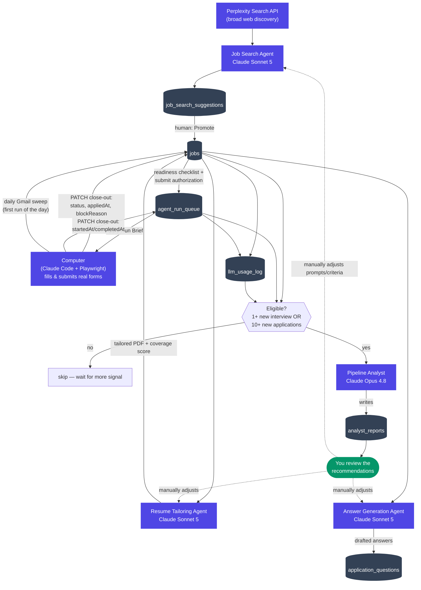

# Architecture

How the four agents in this project fit together, and how data flows from
a search result to a real interview. See [README.md](README.md) for setup
and [HANDOFF.md](HANDOFF.md) for current operational state and gotchas —
this file is the structural picture.

## The four agents

| Agent | Model | Cadence | What it does |
|---|---|---|---|
| **Job Search Agent** | Perplexity Search API + Claude Sonnet 5 | On demand (button click) | Perplexity does broad web discovery across several parallel queries; one bounded Sonnet call structures, dedupes, and scores whatever it found against your profile. Never writes to the real pipeline directly — results land as suggestions requiring an explicit "Promote" action. |
| **Resume Tailoring Agent** | Claude Sonnet 5 | Per job, on demand | Reorders your fixed bullet inventory and swaps in pre-approved synonym phrasing for a given job description. Bounded by construction — it can only choose from what already exists, never invent new resume content. |
| **Answer Generation Agent** | Claude Sonnet 5 | Per application question | Drafts grounded answers to scraped short-answer prompts, checking a reusable question bank first and falling back to your story bank for a fresh completion. |
| **Pipeline Analyst** | Claude Opus 4.8 | Triggered by new signal, not a schedule | Reviews the *entire* history of tracked jobs — resume angle, coverage score, cost, timing, and outcome (interview / blocked / applied) — and writes a short, data-grounded analysis: what's correlating with interviews, what's wasting spend, concrete suggested changes. Never edits anything itself; a human decides what to act on. |

Plus **"Computer"** — not a background service, but this exact kind of
Claude Code session, driving a real Playwright browser to fill and submit
actual application forms, and to do the periodic Gmail interview sweep. It's
the one part of the loop that isn't a Next.js API route.

## Why Opus only shows up once

The first three agents run frequently (every search, every job, every
question) on bounded, well-specified tasks — Sonnet is fast, cheap, and
already good enough for them. The Analyst runs rarely, reasons over
aggregated history rather than a single input, and its mistakes are more
costly (bad strategic advice vs. a slightly awkward bullet reorder) — that's
the shape of task Opus's higher per-token cost is actually worth paying for.
Running Opus on every tailoring/search/answer call instead would raise
per-application cost substantially for no real gain, since those tasks
don't need Opus-level reasoning to begin with.

## Trigger model: signal, not schedule

The Analyst doesn't run on a timer. `checkAnalystEligibility()`
(`src/lib/analyst/eligibility.ts`) compares the current state against the
last report and becomes eligible when either:
- **1+ new first-round interview** has landed since the last report (the
  rarest, highest-value signal in the whole pipeline), or
- **10+ new applications** have accumulated since the last report.

Every run still analyzes the *entire* job history, not just what's new —
frequency of triggering and amount of data considered are independent; more
frequent runs wouldn't see more data, they'd just mean paying for Opus to
mostly restate yesterday's conclusions. `POST /api/analyst/run` checks
eligibility itself and no-ops cheaply if nothing's changed enough, unless
called with `{ force: true }`.

## End-to-end flow

## What the Analyst actually sees

Per job: company, title, role family, resume angle, coverage score, search
match score, status, block reason, estimated dollars spent on that specific
job (joined from `llm_usage_log` by `jobId`), days from discovered to
applied, and whether it produced a first-round interview. Plus pipeline
totals: total spend, suggestion funnel counts. All of it is real,
already-instrumented data — no new tracking was needed to build this, only
a new reader.

It does **not** currently see the literal rendered resume text or the live
browser-fill transcript — just the structured `tailoringPlan` (which bullets
got reordered, which phrases got swapped, and why) that produced the PDF.
