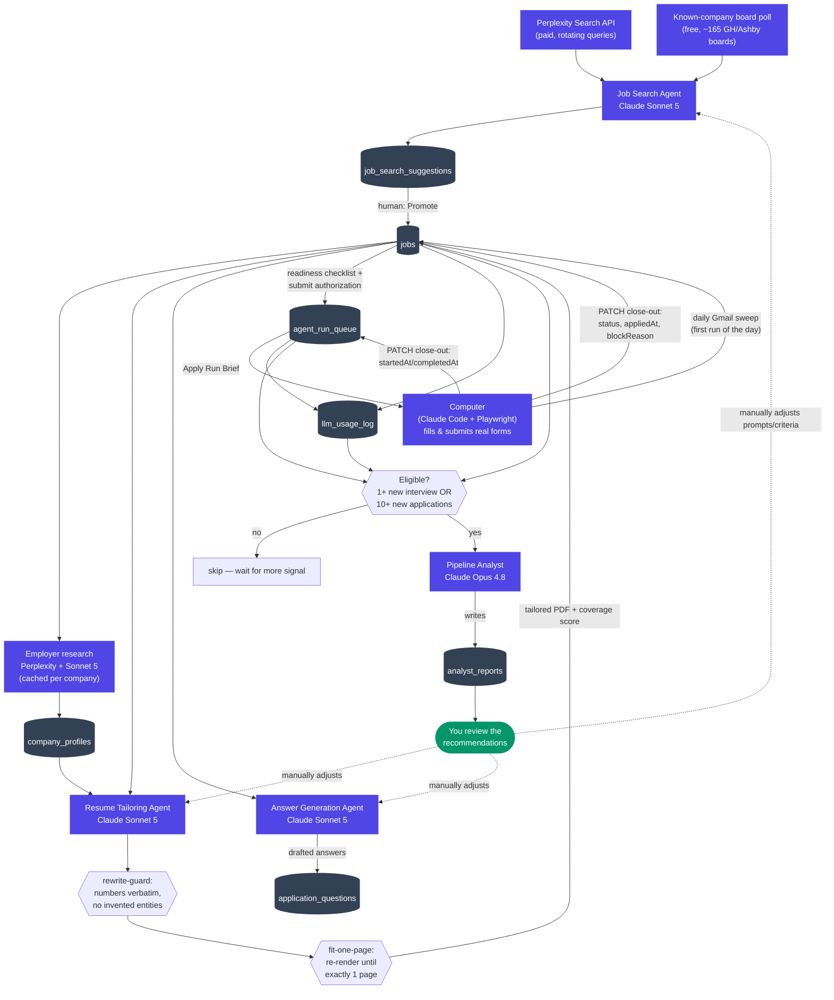

# Architecture

How the four agents in this project fit together, and how data flows from
a search result to a real interview. See [README.md](README.md) for setup
and [HANDOFF.md](HANDOFF.md) for current operational state and gotchas —
this file is the structural picture.

## The four agents

| Agent | Model | Cadence | What it does |
|---|---|---|---|
| **Job Search Agent** | Perplexity Search API + Claude Sonnet 5 | On demand (button click) | Perplexity does broad web discovery across several parallel queries; one bounded Sonnet call structures, dedupes, and scores whatever it found against your profile. Never writes to the real pipeline directly — results land as suggestions requiring an explicit "Promote" action. |
| **Resume Tailoring Agent** | Claude Sonnet 5 | Per job, on demand | Reorders your fixed bullet inventory, swaps in pre-approved synonym phrasing, and rewords bullets into the job posting's own vocabulary for ATS keyword matching. Bounded by verification rather than by construction: every reword is re-checked in code (`rewrite-guard.ts`) and discarded unless it preserves the original's numbers verbatim and every named entity — so wording adapts per job while the facts cannot. |
| **Answer Generation Agent** | Claude Sonnet 5 | Per application question | Drafts grounded answers to scraped short-answer prompts, checking a reusable question bank first and falling back to your story bank for a fresh completion. |
| **Pipeline Analyst** | Claude Opus 4.8 | Triggered by new signal, not a schedule | Reviews the *entire* history of tracked jobs — resume angle, coverage score, cost, timing, and outcome (interview / blocked / applied) — and writes a short, data-grounded analysis: what's correlating with interviews, what's wasting spend, concrete suggested changes. Never edits anything itself; a human decides what to act on. |

Plus **"Computer"** — not a background service, but this exact kind of
Claude Code session, driving a real Playwright browser to fill and submit
actual application forms, and to do the periodic Gmail interview sweep. It's
the one part of the loop that isn't a Next.js API route.

## Bounded by verification, not by construction

The Resume Tailoring Agent originally could not invent anything because it was only allowed to *reorder* bullets and pick from a per-bullet list of pre-approved synonyms. That made fabrication structurally impossible — and also capped how well a resume could match a posting, since the one thing that moves an ATS keyword score is using the posting's own vocabulary.

The agent can now reword bullet text. The safety property moved from the shape of the plan to a check on its contents, and there is deliberately **no human approval step** in front of it, so the check is the boundary.

`src/lib/resume/rewrite-guard.ts` — `validateRewrite()` accepts a reworded bullet only if:

1. **Every number is preserved exactly as written.** Not "the same value" — the same characters. `$3M` may not become `$3 million`, because once reformatting is allowed there's no cheap way to distinguish a faithful reformat from a magnitude error (`$3M` → `$3B` is one keystroke).
2. **No new number appears.** This is the fabrication that matters most on a resume; a model asked to strengthen a bullet will otherwise invent a percentage.
3. **Every proper noun and acronym survives, and none is invented.** Dropping one loses real context; adding one claims a tool, employer or system that was never there. The first word is exempt — that's the action verb, and `Reduced` → `Cut` is legitimate.
4. **Length stays within 0.55–1.6× the original**, so a bullet can't be padded into a paragraph or gutted to a fragment.

A rewrite that fails any check is silently discarded and the original text is used. A rejected rewrite is not an error — it just means that bullet wasn't reworded. The guard also accepts the bullet's own pre-approved synonyms as supporting vocabulary, because `go-to-market efforts` → `GTM efforts` is a blessed swap even though `GTM` appears nowhere in the original.

### The one-page constraint

`src/lib/resume/fit-one-page.ts` — the base resume is deliberately tuned to fill exactly one page with very little slack, and pdfkit adds a second page silently. The first reworded resume grew total bullet text by **1%** and rendered as two pages with nothing to catch it.

So the fit is verified against the rendered PDF (`countPdfPages()` counts `/Type /Page` objects), and `fitPlanToOnePage()` gives length-adding tailoring back one item at a time, re-rendering after each, until it fits. Give-back order:

1. Items that actually grew — they're why it overflows. (Character delta is only a proxy for height, so once the growers are gone the rest stay eligible rather than the loop giving up.)
2. **Synonym swaps before rewrites.** A swap is alternate phrasing of the same idea; a rewrite carries the posting's vocabulary, which is the thing being scored. Dropping rewrites first was measurably wrong — it stripped every keyword-bearing rewrite while leaving the merely-longer swaps that caused the overflow.
3. Older roles before the current one — the top of the resume is what a recruiter reads first.
4. Biggest space win first, to converge in fewer re-renders.

Bullet and skill *ordering* is never given back: it costs no space and carries most of the relevance gain. If the resume still overflows with zero rewrites and zero swaps, that's reported as a base-resume problem rather than papered over by cutting content.

## Discovery: two channels

| Channel | Cost | How it works |
|---|---|---|
| **Perplexity Search API** | $5/1k requests, flat | 11 queries per run drawn from a 32-phrase role pool, rotating on 15-minute buckets so several runs a day draw different slices. Two recency tracks per run: an incremental sweep with an exact date filter, plus a no-recency backfill sweep. Pricing is flat regardless of result count, so asking for 20 results costs the same as asking for 1 — which is why `MAX_RESULTS_PER_QUERY` is set high. |
| **Known-company board poll** | Free | Every company with a resolvable Greenhouse/Ashby board token (≈165 of them, derived from jobs already on file) is polled directly against the ATS's public API. Fresh by construction, since it *is* the live board. |

Rotation is deterministic and needs no persisted cursor: the slice index is a function of a time bucket, and `buildDiscoveryQueries` accepts a `rotationSeed` so tests can pin it. Rotation used to be keyed to the calendar day and advanced by one position at a time, which meant running the agent twice in a day fired near-identical queries — 7 of 8 phrases shared.

### The Exa evaluation (implemented, not shipped)

`src/lib/search/exa-discover.ts` is a drop-in alternative to the Perplexity channel, built for measurement rather than for production. It reuses `buildDiscoveryQueries` **verbatim** so query text, rotation and domain filter are byte-identical and the only variable is the retrieval engine. `scripts/compare-search-providers.mts` is the harness; it reads the known-company snapshot but never persists, because the live route excludes already-seen pairs forever and whichever arm wrote first would poison the other's score.

Measured result: Exa returned more precise links (~94% usable vs ~82%) at ~3× the cost, and the two engines barely overlapped (Jaccard 0.08–0.11 on usable URLs). The conclusion was to run both — until the `matchLiveJob` bug below was fixed, which removed the premise. **Nothing was switched; Perplexity plus the free board poll remain the live path.** Full numbers and the reversal are in [`HANDOFF.md`](HANDOFF.md).

### Identity, not similarity

`matchLiveJob()` in `src/lib/search/live-board.ts` answers "which posting on this board is the one we already believe in". It originally returned the *first* job passing a ≥70% word-overlap check, which silently rewrote a posting's apply URL to a **different** job at the same company — most of DoorDash's ~26 distinct Strategy & Ops roles collapsed onto one URL.

It now prefers an exact normalized-title match, falls back to the *best*-scoring loose match rather than the first, and returns `null` on a tie — an ambiguous result means the posting can't be identified, not licence to pick one. `resolveCandidateFreshness` also short-circuits via `sameBoardUrl()` when the candidate's own URL is already an open posting on that board, since a URL that came straight off the board never needed recovering.

Fixing this took net-new suggestions per run from **1 to 31**, and the "already known" count from 159 to 4. Three unrelated-looking symptoms — searches yielding almost nothing, a 96% duplicate rate, and applications pointing at the wrong posting — were all this one bug.

## Why Opus only shows up once

The first three agents run frequently (every search, every job, every
question) on bounded, well-specified tasks — Sonnet is fast, cheap, and
already good enough for them. The Analyst runs rarely, reasons over
aggregated history rather than a single input, and its mistakes are more
costly (bad strategic advice vs. a slightly awkward bullet reorder) — that's
the shape of task Opus's higher per-token cost is actually worth paying for.
Running Opus on every tailoring/search/answer call instead would raise
per-application cost substantially for no real gain, since those tasks
don't need Opus-level reasoning to begin with.

## Trigger model: signal, not schedule

The Analyst doesn't run on a timer. `checkAnalystEligibility()`
(`src/lib/analyst/eligibility.ts`) compares the current state against the
last report and becomes eligible when either:
- **1+ new first-round interview** has landed since the last report (the
  rarest, highest-value signal in the whole pipeline), or
- **10+ new applications** have accumulated since the last report.

Every run still analyzes the *entire* job history, not just what's new —
frequency of triggering and amount of data considered are independent; more
frequent runs wouldn't see more data, they'd just mean paying for Opus to
mostly restate yesterday's conclusions. `POST /api/analyst/run` checks
eligibility itself and no-ops cheaply if nothing's changed enough, unless
called with `{ force: true }`.

## End-to-end flow

```mermaid
flowchart TD
    PD["Perplexity Search API<br/>(paid, rotating queries)"] --> JSA["Job Search Agent<br/>Claude Sonnet 5"]
    BP["Known-company board poll<br/>(free, ~165 GH/Ashby boards)"] --> JSA
    JSA --> JSS[("job_search_suggestions")]
    JSS -->|"human: Promote"| J[("jobs")]

    J --> CR["Employer research<br/>Perplexity + Sonnet 5<br/>(cached per company)"]
    CR --> CP[("company_profiles")]
    CP --> RT
    J --> RT["Resume Tailoring Agent<br/>Claude Sonnet 5"]
    RT --> RG{{"rewrite-guard:<br/>numbers verbatim,<br/>no invented entities"}}
    RG --> FIT{{"fit-one-page:<br/>re-render until<br/>exactly 1 page"}}
    FIT -->|"tailored PDF + coverage score"| J

    J --> AG["Answer Generation Agent<br/>Claude Sonnet 5"]
    AG -->|"drafted answers"| AQ[("application_questions")]

    J -->|"readiness checklist +<br/>submit authorization"| ARQ[("agent_run_queue")]
    ARQ -->|"Apply Run Brief"| Computer["Computer<br/>(Claude Code + Playwright)<br/>fills & submits real forms"]
    Computer -->|"PATCH close-out:<br/>status, appliedAt, blockReason"| J
    Computer -->|"PATCH close-out:<br/>startedAt/completedAt"| ARQ
    Computer -->|"daily Gmail sweep<br/>(first run of the day)"| J

    J --> LLM[("llm_usage_log")]
    ARQ --> LLM

    J --> Elig{{"Eligible?<br/>1+ new interview OR<br/>10+ new applications"}}
    ARQ --> Elig
    LLM --> Elig
    Elig -->|no| Skip["skip — wait for more signal"]
    Elig -->|yes| PA["Pipeline Analyst<br/>Claude Opus 4.8"]
    PA -->|"writes"| AR[("analyst_reports")]
    AR --> Human(["You review the<br/>recommendations"])
    Human -.->|"manually adjusts prompts/criteria"| JSA
    Human -.->|"manually adjusts"| RT
    Human -.->|"manually adjusts"| AG

    classDef agent fill:#4f46e5,color:#fff,stroke:none;
    classDef store fill:#334155,color:#fff,stroke:none;
    classDef human fill:#059669,color:#fff,stroke:none;
    class PD,BP,JSA,RT,AG,PA,Computer,CR agent;
    class JSS,J,AQ,ARQ,LLM,AR,CP store;
    class Human human;
```

## What the Analyst actually sees

Per job: company, title, role family, resume angle, coverage score, search
match score, status, block reason, estimated dollars spent on that specific
job (joined from `llm_usage_log` by `jobId`), days from discovered to
applied, and whether it produced a first-round interview. Plus pipeline
totals: total spend, suggestion funnel counts. All of it is real,
already-instrumented data — no new tracking was needed to build this, only
a new reader.

It does **not** currently see the literal rendered resume text or the live
browser-fill transcript — just the structured `tailoringPlan` (which bullets
got reordered, which phrases got swapped, and why) that produced the PDF.
