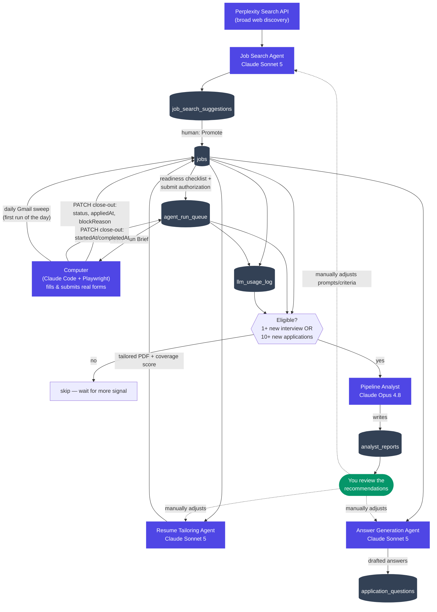

# Job Finder Agent

A personal job-application command center: track roles through a pipeline, generate ATS-friendly tailored resumes, scrape application short-answer prompts, draft grounded answers from a story bank, discover new matching roles, and queue ready applications for an external browser-automation agent to fill in and (optionally) submit.

**This app never submits an application itself.** It prepares resumes, drafts answers, and queues explicit application runs. Actual form-filling/submission is performed by a separate browser-automation step, outside this codebase, only after you authorize it.

## What it does

- **Pipeline** — track jobs through discovered → approved → applied/blocked, with approve/reject/edit/delete actions.
- **Resume Tailor** — generates a tailored, ATS-friendly PDF per job from your base resume, preserving your exact formatting. A Claude agent decides bullet order, phrasing swaps, and rewords bullets to use the job posting's own terminology so they match ATS keyword scans and read as written for the role. It cannot invent: every reword is re-verified in code and thrown away unless it keeps every number exactly as written and every named company, tool and system from the original. Your base resume is never modified — rewording is per job. A diff view shows exactly what changed before you ever attach it to a real application.
- **One-page guarantee** — the tailored PDF is verified to be exactly one page by counting pages in the *rendered* output, not by estimating character counts. Rewording can add length and the base layout sits right at the page boundary, so when a tailored resume overflows the fitter gives tailoring back — synonym swaps first, then rewrites, oldest roles before the current one — and re-renders until it fits.
- **Employer research** — before tailoring, a cached profile of the company (what it builds, who for, what it likely values in an ops hire) is fetched once per employer and reused across every job there, so the agent isn't tailoring against a company name alone.
- **Application Packet** — scrapes candidate-written short-answer prompts from Greenhouse postings (and a generic fallback for other platforms), and drafts grounded answers from your story bank, which you review and approve.
- **Apply Agent** — a readiness checklist (resume ready, apply link on file, prompts scanned/approved, work-auth confirmed) and a submit-authorization toggle, which produces a "Computer Apply Run Brief" for a separate browser-automation step.
- **Run Queue** — the persisted handoff point: queued application tasks with full context, so you never have to paste a brief by hand.
- **Search / Import** — an agentic feature that discovers currently-open postings matching your criteria, scores them, and surfaces them as suggestions. Nothing lands in your pipeline automatically — you review and explicitly promote each one.
- **Pipeline Analyst** — an occasional, high-level pass (Claude Opus) over your entire application history that surfaces what's actually correlating with interviews and what's wasting spend. Triggered by new signal, not a schedule. See [ARCHITECTURE.md](ARCHITECTURE.md).
- **Settings** — your candidate profile, work-authorization defaults, target search criteria, base resume (as structured data), and story bank, all editable from the UI.

## Four agents, one external

See [ARCHITECTURE.md](ARCHITECTURE.md) for the full write-up (why Opus only shows up once, what the Analyst actually sees, the trigger model).

- **Job Search Agent** — Perplexity's Search API does broad web discovery across several parallel queries; one bounded Claude Sonnet call structures, dedupes, and scores whatever it found. Results are suggestions only, never auto-added to your pipeline.
- **Resume Tailoring Agent** — reorders your fixed bullet inventory, swaps pre-approved synonym phrasing, and rewords bullets toward the posting's vocabulary. Every choice is re-validated in code regardless of what the model returns; a reword that changes a number, drops a named entity or introduces an unsupported one is silently discarded in favour of the original.
- **Answer Generation Agent** — a single grounded completion per prompt, drawing only from your story bank via deterministic keyword retrieval.
- **Pipeline Analyst** — Claude Opus, run occasionally (triggered by new applications or a new interview, not a clock), reasoning over the full pipeline's history to surface what's working. Never edits anything itself.
- **"Computer" (external, not built here)** — whatever browser-automation tool you point at the Run Queue to actually fill in and (if authorized) submit forms. This dashboard hands off a structured brief and stops.



## Stack

- Next.js 16 (App Router, TypeScript, Turbopack) on Vercel
- Supabase: Postgres (via Drizzle ORM), Storage (generated resume PDFs), Auth (single-account gate), Row Level Security on every table
- pdfkit + bundled Carlito font (Calibri-metric-compatible, OFL-licensed) for resume PDF generation
- Claude API (`claude-sonnet-5` for tailoring/answers/search-structuring, `claude-opus-4-8` for the Pipeline Analyst)
- Two discovery channels: the Perplexity Search API (paid, rotating query set) and direct polling of known Greenhouse/Ashby boards (free). The Exa Search API is implemented as a measured alternative but is **not** in the live path — see [ARCHITECTURE.md](ARCHITECTURE.md#discovery-two-channels)
- cheerio for prompt scraping

## Public repo, private data

This repo is public and generic by design — no personal data lives in source control, ever. Your resume, story bank, and profile are seeded into the database from a gitignored `local/*.seed.json` file (see [`local/README.md`](local/README.md)); only generic `*.example.json` templates are committed. Row Level Security is enabled on every table with zero policies, so only the server-side service-role connection can read/write — the public `anon` key (necessarily shipped in the browser bundle for Supabase Auth) gets nothing.

## Getting your own instance running

1. **Create a Supabase project** (Postgres + Storage + Auth). See [`DEPLOYMENT.md`](DEPLOYMENT.md) for exact steps.
2. **Get an `ANTHROPIC_API_KEY`** from [console.anthropic.com](https://console.anthropic.com).
3. **Clone and install:**
   ```bash
   git clone https://github.com/gpatanker/job-finder-agent.git
   cd job-finder-agent
   npm install
   ```
4. **Copy `.env.example` to `.env.local`** and fill in your Supabase/Anthropic values (see [Environment variables](#environment-variables) below).
5. **Run the database migration:**
   ```bash
   npm run db:migrate
   ```
6. **Seed your profile, resume, and story bank:**
   ```bash
   cp local/profile.example.json local/profile.seed.json
   cp local/resume.example.json local/resume.seed.json
   cp local/story-bank.example.json local/story-bank.seed.json
   # edit those three files with your real information, then:
   npm run db:seed-profile
   ```
7. **Create your login account** in Supabase Auth (Dashboard → Authentication → Users → Add user), matching the email you'll sign in with.
8. **Run it:**
   ```bash
   npm run dev
   ```

## Environment variables

| Variable | Where to find it |
|---|---|
| `NEXT_PUBLIC_SUPABASE_URL` | Supabase → Project Settings → General (Project ID) → `https://<project-id>.supabase.co` |
| `NEXT_PUBLIC_SUPABASE_ANON_KEY` | Supabase → Project Settings → API Keys → Publishable key |
| `SUPABASE_SERVICE_ROLE_KEY` | Supabase → Project Settings → API Keys → Secret key (full access — treat like a password) |
| `DATABASE_URL` | Supabase → Connect → Direct (Postgres URI), Transaction pooler mode, with your DB password substituted in |
| `ANTHROPIC_API_KEY` | [console.anthropic.com](https://console.anthropic.com) → Settings → API Keys |
| `PERPLEXITY_API_KEY` | [perplexity.ai/settings/api](https://www.perplexity.ai/settings/api) — used by job-search discovery and employer research. Billed at a flat $5/1k requests regardless of result count |
| `EXA_API_KEY` | Optional. [dashboard.exa.ai](https://dashboard.exa.ai) — only needed to run `scripts/compare-search-providers.mts`; the live pipeline runs on Perplexity |
| `SEED_DEMO_DATA` | Leave at `0`. Only set to `1` locally to seed generic demo jobs (`npm run db:seed-demo`) |
| `E2E_LOGIN_EMAIL` / `E2E_LOGIN_PASSWORD` | Only needed to run `npm run test:e2e` locally |

## Database migrations & seed notes

- Schema lives in `src/lib/db/schema.ts`; migrations are generated with `npm run db:generate` and applied with `npm run db:migrate`.
- Every table has Row Level Security enabled with **no policies** — only the service-role connection (server-side only) can touch them.
- `candidate_profile` and `resume_profile` are singleton tables (one row) — re-running `npm run db:seed-profile` replaces them wholesale, safe to re-run after editing your local seed files.
- `story_bank_entries` are upserted by `slug` — safe to re-run after edits.
- `jobs.is_sample` gates demo data out of every list query by default; `SEED_DEMO_DATA=1` is required to seed demo rows, and `npm run db:cleanup-demo` removes them (cascades to dependent `application_questions`/`agent_run_queue` rows via FK).

## Testing

See [`TESTING.md`](TESTING.md) for the full report: commands, what's covered, and results.

Quick reference:
```bash
npx tsc --noEmit       # typecheck
npm run build          # production build
npm run test           # Vitest unit tests (295 tests / 31 files, no live services needed)
npm run test:e2e       # Playwright E2E against a real running app (needs credentials)
```

## Known limitations

- **Ashby application questions can't be scraped.** Their application form (including custom questions) loads client-side after "Apply" is clicked — confirmed by inspecting live postings and Ashby's own public API, which only exposes listing/description fields. The scraper says so explicitly rather than pretending to work; add prompts manually for Ashby postings.
- **Generic-platform scraping is best-effort.** JavaScript-rendered, multi-step, or auth-gated forms may return nothing — the UI is upfront about this rather than silently failing.
- **Job Search Agent results can be stale or wrong**, since they come from a live web search. That's why they land in a review queue requiring explicit promotion, never directly in your pipeline.
- **No headless browser anywhere in this app** (by design) — scraping is fetch/HTML-based, and actual form-filling/submission happens in a separate tool you point at the Run Queue.
- **The pipeline can't record its own best outcome.** `jobs.status` runs `discovered → … → applied / blocked / rejected / archived` with no `offer` state, and nothing currently sets `rejected` either — so offers and rejections both have to be read out of email rather than the dashboard. Adding an `offer` status is the top outstanding schema gap.
- **`firstRoundInterviewAt` can't be set through the API.** `updateJobSchema` doesn't include the field, so `PATCH /api/jobs/{id}` returns `200` and silently changes nothing. The daily interview sweep writes it directly via Drizzle as a workaround.
- **Third-party form APIs rate-limit under batch load.** Driving a dozen applications in one session exhausted Ashby's location-autocomplete service mid-run (it degraded to region-level results, then returned nothing), which makes any form with a required location autocomplete unfillable until it recovers. Large batches should be spread out.
- **Vercel Preview-environment env vars** hit a CLI quirk during setup and aren't currently configured — not blocking since this project only uses `main`/Production; revisit if branch previews are needed later.

## Deployment

See [`DEPLOYMENT.md`](DEPLOYMENT.md).

## Roadmap

See [`ROADMAP.md`](ROADMAP.md) for the plan toward a multi-user Vercel/Supabase version.

## License

MIT — see `LICENSE`.
